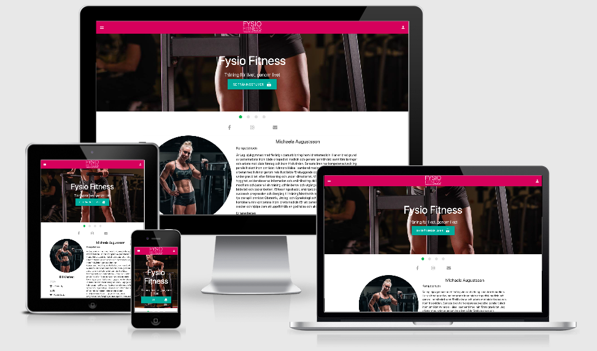

# Fysio Fitness
​
Michaela Augustsson is a swedish atlete who for example won the swedish championships in Atletic Fitness. Fysio Fitness is a company where Michaela helps the customers with finding the training best suited for them. 
​
The site is an E-commerce that sells access to videos with training instructions.

#  #
 
## UX
 
- As a Visitor of the home-page I want to find training movies.
- As an Visitor I want to follow Fysio Fitness on social media (Facebook/Instagram).
- As an Visitor I want to be able to email Fysio Fitness with private questions.
- As a Visitor of the home-page I want to know more about Fysio Fitness.
- As a Visitor I want to know more about the different plans for Training movies.
- As a Visitor I want to find a way to pay for a plan.
- As a Customer I should be able to pay for a plan.
    - Non existing user
        - Test that we get 302 to /users/videos
        - Test that we get an Order with total_amount = price on plan
        - Test that we can get a user with username as email
        - Test that we are logged in
    - If a user already exists
        - Test that we get 302 to /account/login
        - Test that we get an order with total_amount = price on plan
    - Valid until
        - Valid until is null -> add days from today
        - Valid until is before today -> add days from today
        - Valid until is after today -> add days from valid until date
- As a Customer I want to be able to watch movies after I paid for a plan.
- As a Customer I want to be able to login.


## Features
 
### Existing Features
- Home page 
    - The main goal of the home page is to enroll the visitor in paid access to the video content. The main focus is the top slider with CTA that leads to the different plans. 
    - A micro conversion is to get the visitor to follow on social media. The value with that is greater exposure and a possibiltiy to convert them at a later stage in the customer journey. 
    - If a customer lands at Fysio Fitness without knowing exactly what it is they will need to know more about why they should sign up. Therefore the main content on the site is the story about Michaela Augustsson for the site to gain creditability.
    - At bottom of page is once again a CTA for videso - so the customer don't have to scroll back up as well as social buttons. 
- Subscription plans
    - Will list the different plans for video access. The goal of the page is to lead the visitor to the Checkout-page.
- Checkout
    - Should be as simple as possible to get conversion rate as high as possible. Will handle payments using Stripe. After payment a customer will get a registered account and be able to access video content.
- Videos
    - As a paid customer you will get access to video content with instructions on how to train better.
- Login
    - For a returning customer you should be able to login
​
### Features Left to Implement
- More videos to come
- Exclusive video content not reachable from outside the app
- Trial period for video content
- Recurring payment to automatically renew access to video content
- Blog for SEO and creditability
​
## Technologies Used
​
- [HTML](https://sv.wikipedia.org/wiki/HTML)
    - For content and structure.
- [CSS](https://sv.wikipedia.org/wiki/Cascading_Style_Sheets)
    - For styling.
- [Materialize](https://materializecss.com/)
    - For grid-systems, icons and some additional styling.
- [GitHub](https://github.com/)
    - For version control.
- [Gitpod](https://gitpod.io/workspaces/)
    - For coding.
- [Heroku](https://heroku.com)
    - For hosting.
- [PostgreSQL](https://www.postgresql.org/)
    - As database.
- [Fontawsome](https://fontawesome.com/)
    - For icons.
- [Google Fonts](https://fonts.google.com/)
    - For font-families.
- [Django](https://www.djangoproject.com/)
    - Used to build the web project.
- [JQuery](https://jquery.com)
    - To simplify DOM manipulation.
- [Stripe](https://stripe.com/)
    - For card payments.
- [Amazon Web Services (AWS)](https://aws.amazon.com/)
    - To store static media content.
​
## Testing
​
Automated tests are written for all apps and use cases can be found in [app]/tests.py.
To run tests run `python3 manage.py test` after checking out the repository and installing all requirements (see local deployment).
​
## Deployment
​
### Local deploy:
- Clone repository from git: `git clone https://github.com/hanna-maja/fysio-fitness`
- Install requirements: `pip3 install -r requirements.txt`
- Create a Django secret key using [djecrety.ir](https://djecrety.ir/)
- Add environment variables:
    - export DEVELOPMENT='TRUE'
    - export SECRET_KEY='[paste SECRET_KEY created above]'
    - export USE_LOCAL_STORAGE='True' 
- Create static content. `python3 manage.py collectstatic` 
- Run app. `python3 manage.py runserver`
- Visit `localhost:8000` in your favorite browser
​
Note - To access /admin, create a superuser using `python manage.py createsuperuser`  
Note2 - Clear database using `python manage.py flush`  (doing this you need to create a new superuser)
​
### Heroku
In order to deploy this project to Heroku:
- Navigate to the [Heroku website](https://dashboard.heroku.com/).
- Click on "New" in the top right hand corner and then select "Create new app" from the dropdown.
- Proceed to give it a unique app name and choose a region that is local to you.
- Once created, scroll down to the Deployment method section on the app's dashboard.
- Choose GitHub as source and master as repository.
- Create a new PostgreSQL resource in Heroku
    - This will automatically create a new database connection string
- Create a Django secret key using [djecrety.ir](https://djecrety.ir/)
- Create a new IAM-user in AWS with S3FullAccess permissions
    - Take note of the secret key and secret access key
- Create a new S3 bucket named fysio-fitness
- Register an account with Stripe and take note of the public key and secret key
- Navigate to the settings page in Heroku and find the section marked "Config Vars".
- Set the following:
​
```
    SECRET_KEY = [Django secret key generated above]
    HEROKU_HOSTNAME = [Hostname in Heroku]
    AWS_SECRET_KEY = [AWS secret key created above]
    AWS_SECRET_ACCESS_KEY = [AWS secret access key created above]
    STRIPE_PUBLIC_KEY = [Stripe public key created above]
    STRIPE_SECRET_KEY = [Stripe secret key created above]
```
​
- In Heroky, click the Deploy tab.
- Under "Manual Deployment", ensure that the master branch is selected and click "Deploy Branch" to get up to a fresh start.
- Before opening the app, make sure latest migrations are run using Heroku console `python3 manage.py migrate`.

Note - To access /admin, create a superuser using `python manage.py createsuperuser` 
​
### Media
- The photos used in this site were obtained from Michaela Augustsson and her page at Instagram page `https://www.instagram.com/michaelaaugustsson/`
​
### Acknowledgements
- I received inspiration for this project from https://piajansson.se/ and https://www.foreverfitsweden.se/index.html
​
### Personal
- Thanks to Michaela Augustsson for providing ideas and content. 
- Thanks to my husband that has supported me during the whole project, directed me when I have been stucked and helped me with tons of stupid questions!
- I also want to say "Thank you" to my supporting mentor Dick Vlaanderen during this project.